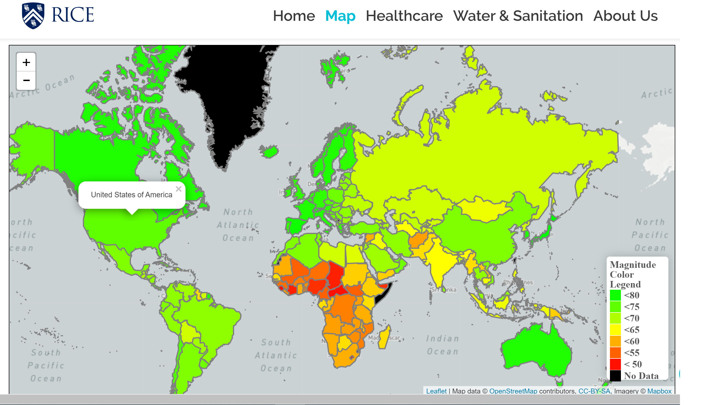
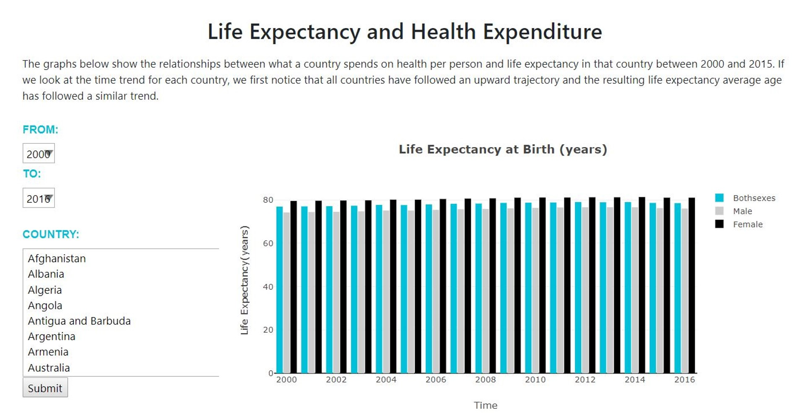
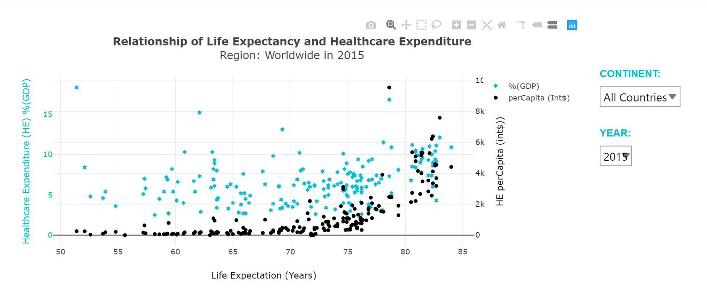
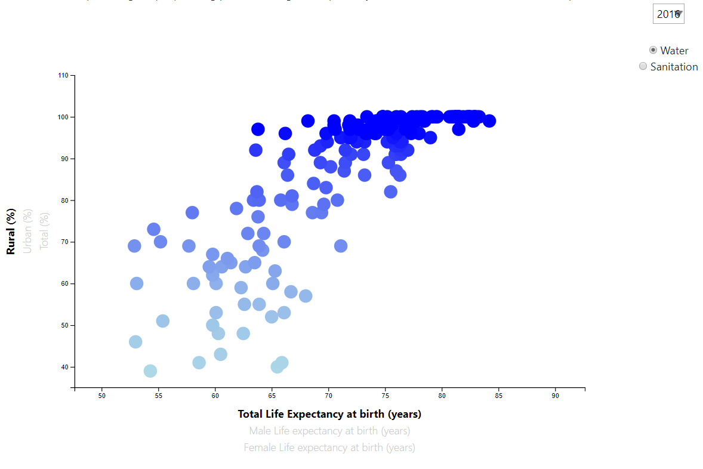

# Project Life Expectancy Analysis

 
## Introduction:

With life expectancy as an overall focus, we focus on trends and factors that have impact on a person's life from healthcare and environmental point of view. We use data from World Health Organization and World Bank to analyze life expectency on a global scale. Our initial thoughts for this analysis were that healthcare expenditures would have the greatest impact on life expectency however, after the analysis, we can conclude that sanitation holds a higher impact, followed by safe water. 

Our project can be found in the link below:
https://life-expectancy-analysis.herokuapp.com

## Data Source:

1.  World Health Organization 
- http://apps.who.int/gho/data/view.main.SDG2016LEXv?lang=en
- http://apps.who.int/gho/data/view.main.SDGCHEPERCAPITAv?lang=en
- http://apps.who.int/gho/data/node.main.WSHSANITATION?lang=en
- http://apps.who.int/gho/data/node.main.WSHWATER?lang=en

2.  World Bank  
- https://data.worldbank.org/indicator/NY.GDP.PCAP.KN

3.  Datahub.io 
- https://datahub.io/core/geo-countries

 
## Getting Started:

These instructions will get you a copy of the project up and running on your local machine for development and testing purposes. 
See deployment for notes on how to deploy the project on a live system.

### Prerequisites:

Python and Jupyter Notebooks are used. Additionally, the following libraries are required

Libraries used are:
1. D3
2. JQuery
3. Plotly
4. Leaflet

Other tools required:
5. geopandas
6. SQLAlchemy
7. Bootstrap
8. HTML; Onepage template
9. Flask
10. CSS

Platforms used:
11. Heroku
12. One Page template from https://onepagelove.com/evolo

### Installing

* install python libraries
* install anaconda v.3.7
* install javascript libraries (D3, jQuery)
* install plotly and leaflet libraries
* install Flask
* install SQLAlchemy

## Running the tests

1. Use Visual Studio Code to load the project folders.
2. Open file index.html and app.py in VS Code.
3. Run the code in VSC using app.py (shortcut key function F5) - which will take you to - http://127.0.0.1:5000/ to view the graph on html template.

Last but not least, download "https://github.com/congtranxuan/RICEBOOTCAMP-Project-2.git" to a local directory.
1. Life_Expectancy_Analysis folder contains:
   - static folder contains [css, db(contains clean data files), images, js, php, webfonts, privacy policy, terms conditions]
   - templates contains (index.html)

## Built With

* [Pandas](https://pandas.pydata.org/) - Used to clean and analyze data 
* [Numpy](https://numpy.org/) - Used to run calsulations (data analysis)
* [Plotly] (https://plot.ly/) - Used to create complex visualizations
* [Leaflet] (https://leafletjs.com) - Used to create map visualizations
* [D3] (https://d3js.org) - Used for creating a chart
* [HTML] (https://onepagelove.com/evolo) - used to create the web template
* [Heroku] (https://www.heroku.com) - used to deploy to online server

## Contributing

Please read [CONTRIBUTING.md](https://gist.github.com/PurpleBooth/b24679402957c63ec426) for details on our code of conduct, and the process for submitting pull requests to us.

## Versioning

v 1.0

## Authors

* Xuan Cong Tran
* Nithya Iyengar
* Misael Obregon

## License

This project is licensed under the Rice License - see the [LICENSE.md](LICENSE.md) file for details

